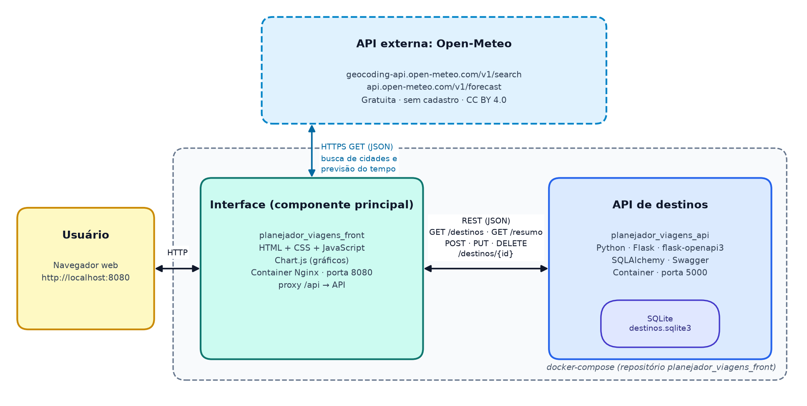

# Planejador de Viagens (Interface)

Interface web para **planejar viagens**. O usuário busca uma cidade, cadastra o destino com datas, orçamento e status, acompanha tudo em um **dashboard** e consulta a **previsão do tempo** do destino antes de viajar.

Este repositório é o **componente principal** do MVP. Ele se comunica com:

- a **API de destinos** [planejador_viagens_api](https://github.com/kevinholtzh-arch/planejador_viagens_api) (Flask + SQLite), que salva os destinos;
- a **API externa Open-Meteo**, usada para buscar cidades (coordenadas) e a previsão do tempo.

---

## Funcionalidades

- **Busca de cidades** pelo nome, com os resultados vindos da Open-Meteo
- **Cadastro** de destino (`POST /destinos`)
- **Listagem** com busca por texto, filtro de status, ordenação e paginação (`GET /destinos`)
- **Edição** de datas, orçamento, status e observações em uma janela modal (`PUT /destinos/{id}`)
- **Exclusão** de destino com confirmação (`DELETE /destinos/{id}`)
- **Dashboard** com indicadores (total de destinos, orçamento total, dias de viagem, próxima viagem) e **gráfico** de destinos por status (`GET /resumo`)
- **Previsão do tempo** de 7 dias para o destino, com gráfico de temperaturas máxima e mínima, ícones do tempo e chance de chuva
- **Registro de chamadas entre componentes**: um painel que mostra em tempo real cada requisição feita à API de destinos e à Open-Meteo (método, URL, status e tempo de resposta)
- Mensagens de feedback (toasts) de sucesso e erro

## Arquitetura



- O **usuário** acessa a interface pelo navegador (porta `8080`).
- A **interface** (HTML, CSS e JavaScript servidos pelo Nginx) chama a **API de destinos** pelo caminho `/api`. O Nginx encaminha essas chamadas para o container da API (porta `5000`).
- A **API de destinos** grava e lê os dados no banco **SQLite**.
- A **interface** consulta diretamente a **API externa Open-Meteo** via HTTPS. Os dados recebidos são tratados e exibidos na própria aplicação, sem redirecionar o usuário.

## API externa utilizada: Open-Meteo

| Item | Informação |
|------|------------|
| Site | https://open-meteo.com |
| Documentação | https://open-meteo.com/en/docs e https://open-meteo.com/en/docs/geocoding-api |
| Custo | Gratuita para uso não comercial |
| Cadastro / chave de API | **Não é necessário** |
| Licença dos dados | [Creative Commons Attribution 4.0 (CC BY 4.0)](https://creativecommons.org/licenses/by/4.0/). A atribuição à Open-Meteo aparece no rodapé da interface. |
| Termos de uso | https://open-meteo.com/en/terms |

**Rotas utilizadas:**

| Rota | Uso na aplicação | Parâmetros usados |
|------|------------------|-------------------|
| `GET https://geocoding-api.open-meteo.com/v1/search` | Buscar cidades pelo nome e obter país, latitude e longitude | `name`, `count=5`, `language=pt`, `format=json` |
| `GET https://api.open-meteo.com/v1/forecast` | Previsão do tempo diária (7 dias) do destino | `latitude`, `longitude`, `daily=weather_code,temperature_2m_max,temperature_2m_min,precipitation_probability_max`, `timezone=auto`, `forecast_days=7` |

## Tecnologias

- HTML5, CSS3 e JavaScript (ES Modules), sem framework
- [Chart.js](https://www.chartjs.org/) para os gráficos (via CDN)
- [Nginx](https://nginx.org/) para servir a interface e encaminhar as chamadas à API
- Docker e Docker Compose

## Estrutura do projeto

```
planejador_viagens_front/
├── index.html              # Página principal
├── css/
│   └── styles.css          # Estilos
├── js/
│   ├── app.js              # Lógica da tela (eventos, renderização, gráficos)
│   ├── apiDestinos.js      # Chamadas à API de destinos (GET, POST, PUT, DELETE)
│   ├── openMeteo.js        # Chamadas à API externa Open-Meteo
│   ├── httpLogger.js       # Registro das chamadas entre componentes
│   └── config.js           # Endereço da API
├── docs/
│   └── arquitetura.png     # Fluxograma da arquitetura
├── nginx.conf.template     # Configuração do Nginx (proxy /api)
├── Dockerfile
├── docker-compose.yml      # Sobe a interface e a API juntas
└── README.md
```

---

## Como executar

Pré-requisito: [Docker](https://docs.docker.com/get-docker/) com Docker Compose.

### Opção 1: aplicação completa com Docker Compose (recomendado)

O `docker-compose.yml` constrói a **API** direto do repositório público [planejador_viagens_api](https://github.com/kevinholtzh-arch/planejador_viagens_api) e a **interface** a partir deste repositório.

1. Clone este repositório:

   ```bash
   git clone https://github.com/kevinholtzh-arch/planejador_viagens_front.git
   cd planejador_viagens_front
   ```

2. Construa e suba os containers:

   ```bash
   docker compose up --build -d
   ```

3. Acesse:
   - Interface: **http://localhost:8080**
   - Swagger da API: **http://localhost:5000/openapi/swagger**

4. Para parar:

   ```bash
   docker compose down
   ```

### Opção 2: containers separados

1. Crie uma rede Docker para os dois containers se comunicarem:

   ```bash
   docker network create viagens
   ```

2. Construa e execute a API (a partir do repositório `planejador_viagens_api`):

   ```bash
   docker build -t planejador_viagens_api https://github.com/kevinholtzh-arch/planejador_viagens_api.git#main
   docker run -d --name api --network viagens -p 5000:5000 planejador_viagens_api
   ```

3. Construa e execute a interface (a partir deste repositório):

   ```bash
   docker build -t planejador_viagens_front .
   docker run -d --name front --network viagens -p 8080:80 planejador_viagens_front
   ```

4. Acesse **http://localhost:8080**

> O Nginx encaminha `/api` para `http://api:5000`. Para usar outro endereço, defina a variável de ambiente `API_URL` ao executar o container, por exemplo `-e API_URL=http://meu-host:5000`.
